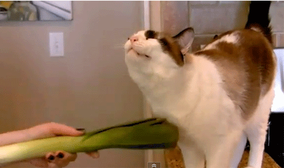

Purr
====


This allows you to walk around stroking the keyboard of your laptop, and it'll purr. 
Works on Macs only.

How to run Purr
====

You'll need to clone into this repository. Do this by opening up your terminal, typing this in and hitting enter:
```
git clone git@github.com:loulai/Purr.git 
```

Change into the directory you just cloned by typing this in your terminal and hitting enter:
```
cd Purr
```

Run it by typing this in your terminal and hitting enter:
```
ruby Purr.rb
```

Stroke your keyboard from left to right. The key `'` or `]` must be included, and you must hit `enter` at the end of your stroke. Happy stroking!

